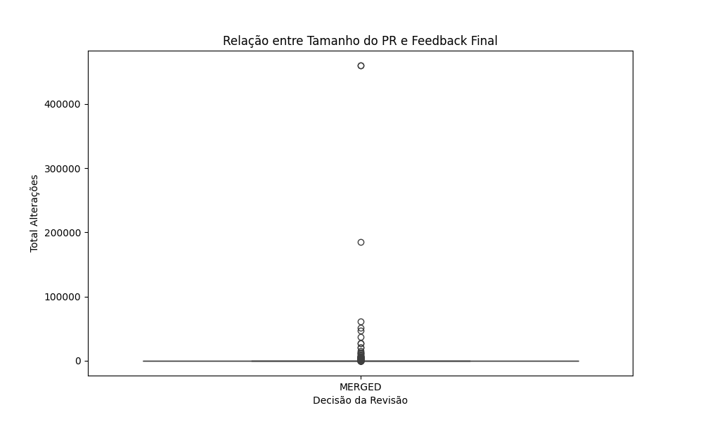
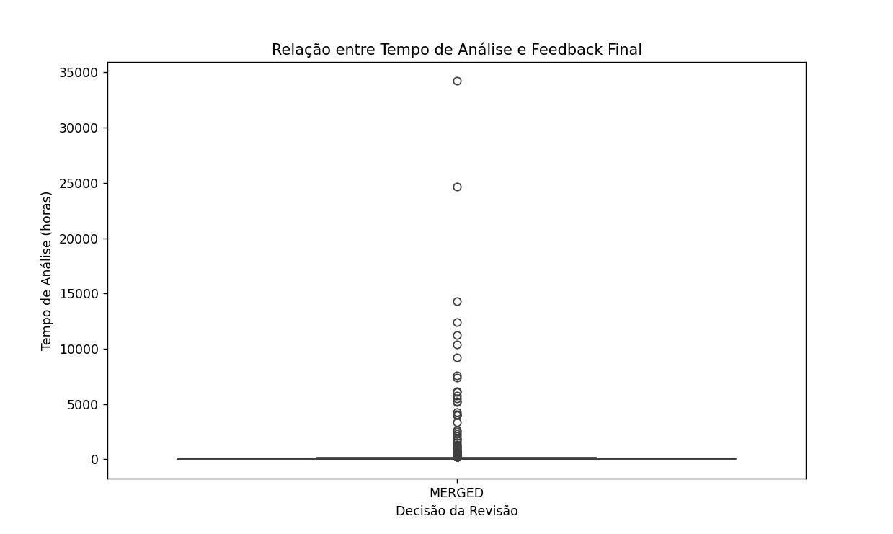
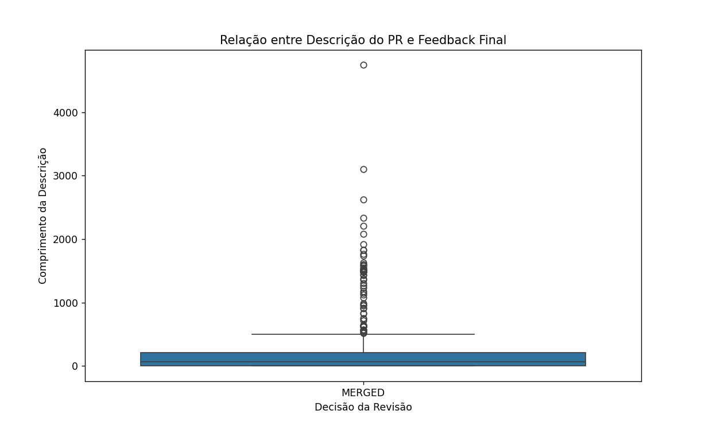
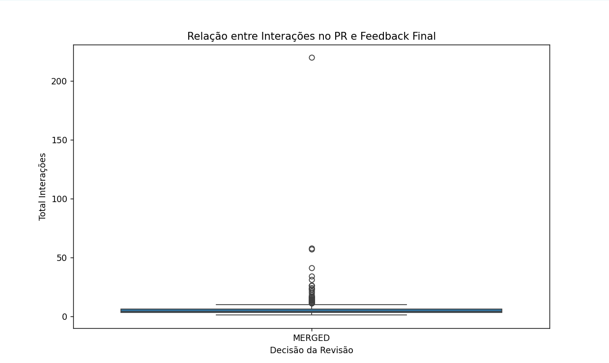
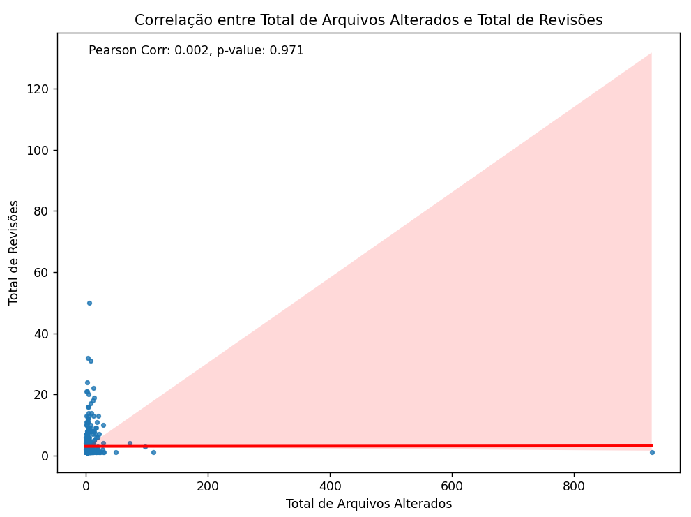
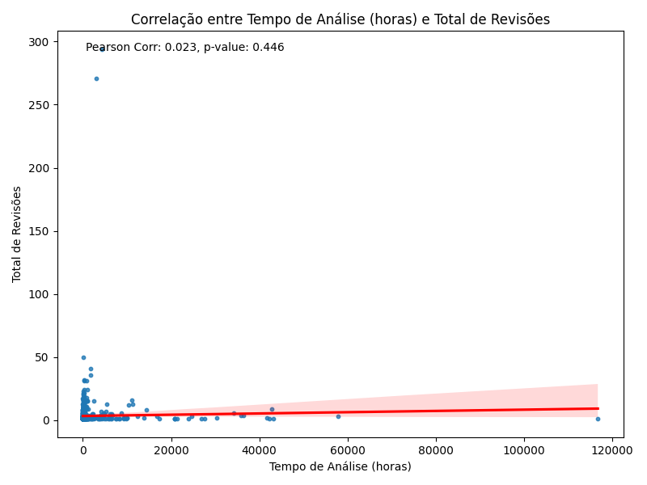
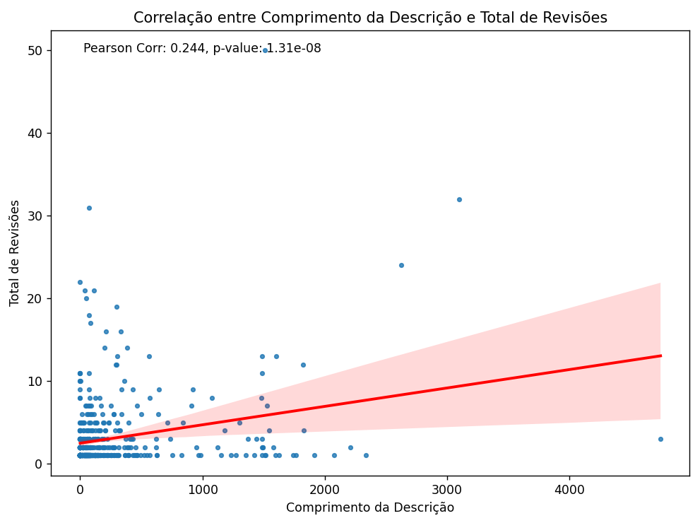
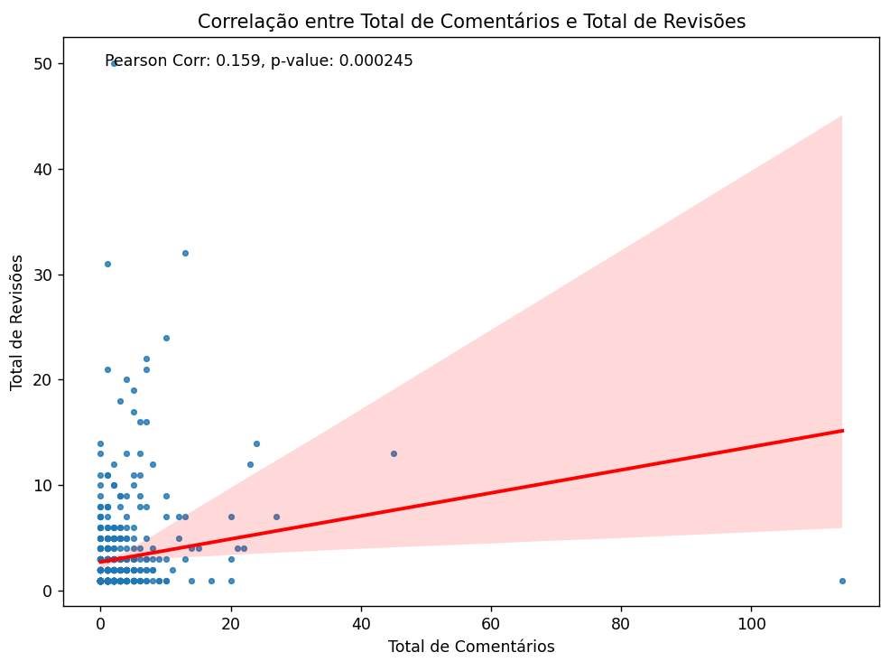

# 📈 Caracterizando a atividade de code review no github 

## 1) Introdução
O presente relatório visa analisar as características sobre a prática de code review.
Essa prática consiste na interação entre desenvolvedores e revisores visando inspecionar o código produzido antes de integrá-lo à base principal. Assim, garante-se a qualidade do código integrado, evitando-se também a inclusão de defeitos.
No contexto de sistemas open source, mais especificamente dos desenvolvidos através do GitHub, as atividades de code review acontecem a partir da avaliação de contribuições submetidas por meio de Pull Requests (PR). Ou seja, para que se integre um código na branch principal, é necessário que seja realizada uma solicitação de pull, que será avaliada e discutida por um colaborador do projeto. Ao final, a solicitação de merge pode ser aprovada ou rejeitada pelo revisor. Em muitos casos, ferramentas de verificação estática realizam uma primeira análise, avaliando requisitos de estilo de programação ou padrões definidos pela organização.

Neste contexto, o objetivo deste laboratório é analisar a atividade de code review desenvolvida em repositórios populares do GitHub, identificando variáveis que influenciam no merge de um PR, sob a perspectiva de desenvolvedores que submetem código aos repositórios selecionados

## 2) Metodologia:
Inicialmente, para extrair as informações foi utilizada a API GraphQL para realização das consultas. Foram realizadas duas querys: uma para extrair os dados dos repositórios populares (com no mínimo 100 estrelas e que continham os pullRequests com status 'MERGED' ou 'CLOSED') e outra para extrair as informações dos pullRequests com a restrição dos mesmos possuírem no mínimo uma hora de revisão. 

É válido ressaltar que na primeira versão do código utilizado para a extração dos dados, a API não funcionou corretamente retornando 'Rate limit remaining: 5000'. Esse erro indica que foi atingido o limite de requisições permitido pela API do GITHUB para o token de acesso. Sendo assim, foram executadas tentativas para solucionar esse problema como utilizar o 'time.sleep(10)' no qual aumenta o tempo de espera da requisição. Porém, mesmo com diversos testes não foi possível solucionar o problema o que colaborou para a refatoração completa do código.

Desse modo, após a refatoração realizada foi possível obter os dados dos pullRequets referentes aos repositórios analisados. Logo, os dados coletados foram salvos em arquivos CSV para compultar o dataset. Posteriormente, foram construídos os gráficos para as questões de pesquisa e realizada a análise para a conclusão das hipóteses estabelecidas baseando-se nos dados e métricas coletadas.

## 3) Resultados Obtidos 
Diante da base extraída, foi realizado um filtro no código de modo que printasse no console os nomes dos PR que foram skipados pelo fato de possuir menos de 1 hora. Foi extremamente notório que a grande maioria foi desconsiderada pelo fato de muitos PRs serem revisados de forma automática: utilizando ferramentas de CI/CD ou bots. Além disso, com o alto índice do uso da inteligência artificial nos últimos meses, indica que a automatização desse processo de análise pode ter sido impactada para colaborar que o tempo de análise seja menor que 1 hora. 

* **RQ 01. Qual a relação entre o tamanho dos PRs e o feedback final das revisões?**
    
       
    **Métrica:** Tamanho do PR (total de alterações) vs. feedback final.

    **Resultado:** O gráfico mostra que a maioria dos PRs aprovados e mesclados contém poucas alterações, enquanto há alguns outliers que apresentam um número muito maior de mudanças. Vale ressaltar que na nossa busca todos os PRs terminaram em "MERGED", o que faz com que esse gráfico e os próximos fiquem lineares em relação ao feedback final.
  
   **Discussão do resultado:** A maior parte dos PRs com um número menor de alterações tende a ser rapidamente mesclada, indicando que PRs menores podem ser mais fáceis de revisar e aprovar.

* **RQ 02. Qual a relação entre o tempo de análise dos PRs e o feedback final das revisões?**
    
       
    **Métrica:** Tempo de análise (horas) vs. feedback final.
  
    **Resultado:** A maioria dos PRs aprovados foi analisada em menos de uma hora, o que pode indicar automação no processo de revisão ou correlacionando com a RQ1, tamanho menor do PR. Alguns outliers apresentaram tempos de análise muito elevados.
  
    **Discussão do resultado:** A maioria dos PRs foram analisados rapidamente ou por CI/CD ou por serem pequenos, enquanto PRs complexos ou esquecidos podem ter tempos de análise significativamente maiores.

* **RQ 03. Qual a relação entre a descrição dos PRs e o feedback final das revisões?**
    
       
  **Métrica:** Tamanho da descrição do PR (número de caracteres) vs. feedback final.

  **Resultado:** A maioria dos PRs aprovados tem descrições com comprimento entre 1000 e 2000 caracteres. Contudo, há alguns outliers com descrições muito mais longas ou mais curtas que fogem desse padrão.

  **Discussão do resultado:** PRs com descrições detalhadas tendem a ser mais aprovados, sugerindo que uma boa explicação pode facilitar a revisão apesar de nao haver uma relação forte. 
    
* **RQ 04. Qual a relação entre as interações nos PRs e o feedback final das revisões?**
    
       
  **Métrica:** Número de interações nos PRs (comentários, revisões, etc.) vs. feedback final.

   **Resultado:** A maioria dos PRs aprovados e mesclados apresenta menos de 25 interações, com apenas alguns outliers que possuem um número significativamente maior de interações.

   **Discussão do resultado:** Isso sugere que a maioria dos PRs requer relativamente poucas interações antes de ser aprovada, o que pode indicar que revisões mais simples ou menos controversas são rapidamente resolvidas. Os poucos outliers, com maior número de interações, provavelmente representam PRs mais complexos ou debatidos.

* **RQ 05. Qual a relação entre o tamanho dos PRs e o número de revisões realizadas?**
    
       
    **Métrica:** Tamanho dos PRs (Total de Arquivos Alterados) vs. numero de revisões realizadas.

    **Resultado:** O gráfico de dispersão gerado mostra uma correlação de Pearson de 0,000 com um valor-p de 0,989. Isso indica uma correlação extremamente fraca e não significativa entre o tamanho dos PRs e o número de revisões.

    **Discussão do resultado:** O tamanho do PR não é um bom preditor do número de revisões. Outros fatores, além do tamanho devem desempenhar um papel mais importante na quantidade de iterações necessárias, como complexidade.

* **RQ 06. Qual a relação entre o tempo de análise dos PRs e o número de revisões realizadas?**
    
       
    **Métrica:** Tempo de Análise: (Tempo gasto para analisar um PR) vs. Número de Revisões.

    **Resultado:** O gráfico de dispersão que geramos mostra uma correlação de Pearson de 0,023 com um valor-p de 0,0446. Essa correlação é considerada fraca e próxima do limite da significância estatística. Ou seja, existe uma leve tendência de que PRs que levam mais tempo para serem analisados também recebam mais revisões, porém com esse dataset a tendencia não se confirma significante o suficiente para afirmar a relação.

    **Discussão do resultado:**  A correlação do gráfico sugere que o tempo de análise e o número de revisões podem estar levemente relacionados, mas outros fatores podem estar influenciando essa relação.

* **RQ 07. Qual a relação entre a descrição dos PRs e o número de revisões realizadas?**
    
       
    **Métrica:** Comprimento da Descrição  vs. Número de Revisões (Quantidade de vezes que o PR passou por revisão e feedback).

    **Resultado:** O gráfico de dispersão mostra uma correlação de Pearson de 0,040 com um valor-p de 0,175. Indicando uma correlação positiva moderada entre o comprimento da descrição e o número de revisões. Portanto, à medida que a descrição do PR aumenta, tende a haver um aumento, mesmo que leve, no número de revisões.

    **Discussão do resultado:**  Houve uma correlação Positiva sugerindo que PRs com descrições mais detalhadas tendem a passar por mais revisões. Possivelmente devido a maior complexidade ou de uma maior compreensão do avaliador devido ao detalhamento.

* **RQ 08. Qual a relação entre as interações nos PRs e o número de revisões realizadas?**
    
       
    **Métrica:**  Total de Comentários vs. Total de Revisões.

    **Resultado:** O gráfico de dispersão apresentado mostra uma correlação de Pearson de 0,86 com um valor-p de 0,00. O que indica uma correlação positiva fraca a moderada entre o total de comentários e o número de revisões.

    **Discussão do resultado:** A correlação positiva sugere que PRs com mais comentários tendem a passar por mais revisões. Provavelmente devido a ter mais pontos e observações a serem resolvidos ou melhorados

## 4) Discussão

Os resultados obtidos no relátorio indicam que PRs menores tendem a ser aprovados mais rapidamente, possivelmente por ferramentas automatizadas. PRs com menos interações e revisões são processados com mais agilidade, enquanto PRs maiores e mais complexos, que envolvem mais comentários, tendem a passar por mais revisões. Apesar de alguns PRs maiores serem aprovados, o número de mudanças e o tempo de análise não mostraram correlação forte com o número de revisões. A automatização, via CI/CD e bots, pode ter impactado o tempo de análise dos PRs. As correlações, embora fracas ou moderadas, sugerem que outros fatores como a complexidade e a clareza das descrições podem influenciar o processo de revisão.
